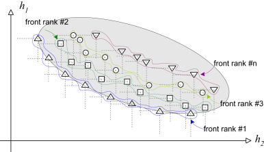

# Evolutionary Method

Two ways of formulating the selection probability of a solution at front rank \(i\)
\((p_{i})\):

1. Inverse proportion:

$$p_{i} = \frac{\left( \frac{1}{i} \right)^{\beta}}{\sum_{k = 1}^{n}{s_{k}\left(
\frac{1}{k} \right)}^{\beta}}$$

2. Boltzmann:

$$p_{i} = \frac{e^{- \beta i}}{\sum_{k = 1}^{n}{s_{k}e^{- \beta k}}}$$

Where

- \(\beta\) is selection pressure and should be tuned! In general \(0 \leq \beta\) and
\(\beta = 0\) means they all have the same probability and \(\beta > 1\) means very high
pressure to select from the first fronts so we can tune it for \(0 \leq \beta \leq 2\)

- \(n\) is the total number of fronts

- \(s_{i}\) is the number of solutions in front rank \(i\)

- And both satisfy:

$$\sum_{i = 1}^{n}{s_{i}p_{i}} = 1$$
